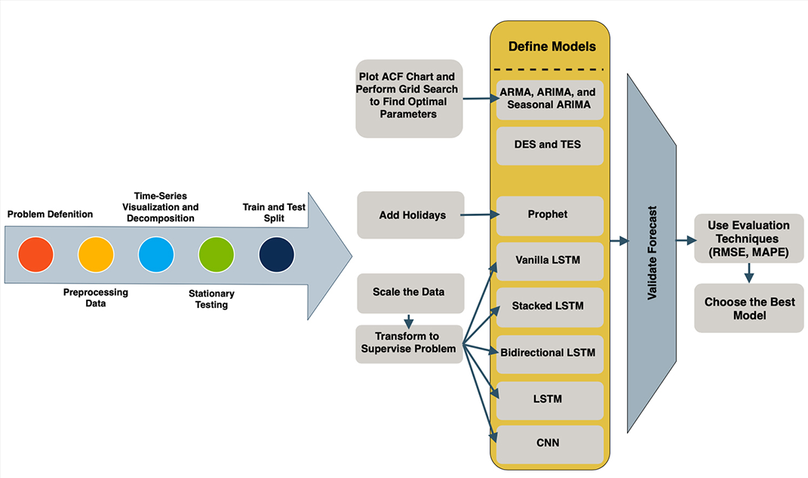
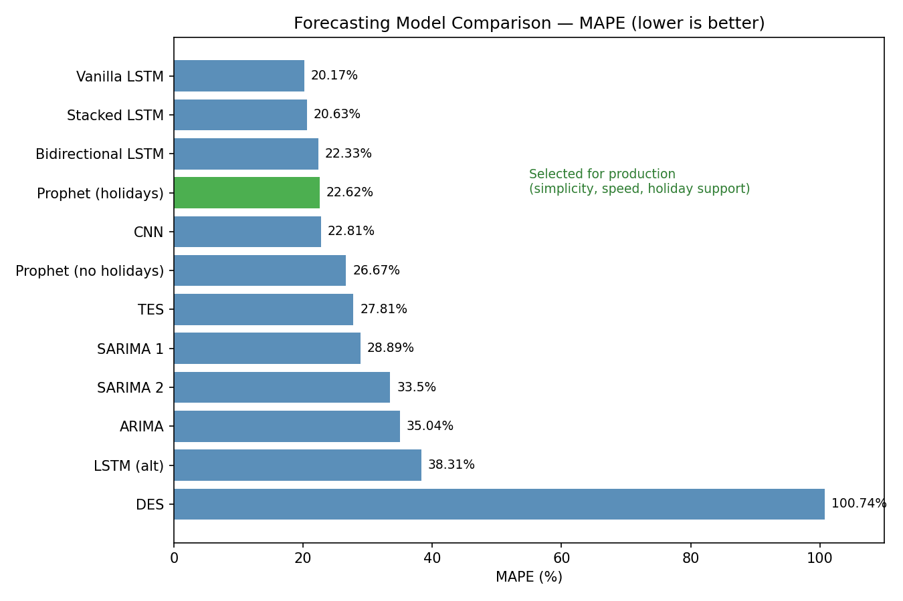
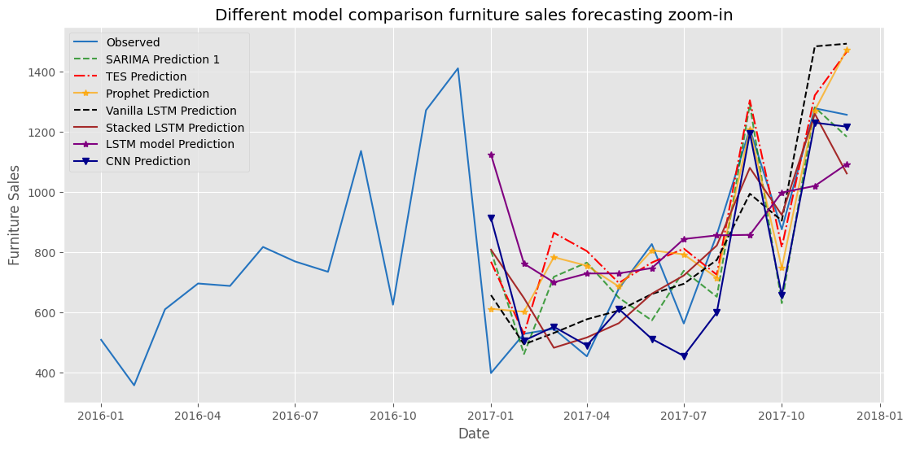

# Sales Demand Forecasting — Model Comparison

A comparative study of 12 time-series forecasting models for retail sales demand prediction, built as part of a larger Inventory Management System (Final Year Project). This component covers data analysis, model evaluation, and selection — the forecasting "brain" behind the inventory platform.

> Note: This repo focuses on the data science/forecasting pipeline. The full Django-based inventory management application (built collaboratively) is maintained separately.

## Overview

Retail businesses struggle to balance stockouts and overstocking due to unreliable demand forecasts. This project evaluates a wide range of forecasting approaches — from classical statistical models to deep learning — to identify the most effective method for predicting product-level sales demand.

## Dataset

The [Fictitious Store dataset](https://www.kaggle.com/datasets/dianavarghese/fictitious-store) from Kaggle (~10,000 records, 2014–2017), covering furniture, technology, and office supplies categories. Analysis focused on furniture sales due to its strong seasonal patterns.

> Dataset not included in this repo — download it from the Kaggle link above and place it in a `data/` folder to run the notebooks.

## Approach

1. **EDA & Preprocessing** — cleaned data, handled missing values, aggregated by date, extracted time-based features
2. **Stationarity testing & decomposition** — analyzed trend, seasonality, and residuals
3. **Model training** — trained and tuned 12 models across 4 families:
   - Statistical: ARIMA, SARIMA (x2)
   - Exponential Smoothing: DES, TES
   - Prophet (with and without holiday effects)
   - Deep Learning: Vanilla LSTM, Stacked LSTM, Bidirectional LSTM, LSTM, CNN
4. **Evaluation** — compared models using MSE, RMSE, and MAPE on a 75/25 train-test split

## Results

| Rank | Model | MSE | RMSE | MAPE |
|---|---|---|---|---|
| 1 | Vanilla LSTM | 24,513.8 | 156.57 | 20.17% |
| 2 | Stacked LSTM | 24,390.2 | 156.17 | 20.63% |
| 3 | Bidirectional LSTM | 30,903.9 | 175.80 | 22.33% |
| 4 | **Prophet (with holidays)** ✅ | **27,986.7** | **167.29** | **22.62%** |
| 5 | CNN | 41,829.4 | 204.52 | 22.81% |
| 6 | Prophet (no holidays) | 37,992.4 | 194.92 | 26.67% |
| 7 | TES | 41,955.4 | 204.83 | 27.81% |
| 8 | SARIMA 1 | 42,305.4 | 205.68 | 28.89% |
| 9 | SARIMA 2 | 55,497.9 | 235.58 | 33.50% |
| 10 | ARIMA | 79,779.2 | 282.45 | 35.04% |
| 11 | LSTM (alt config) | 83,516.4 | 288.99 | 38.31% |
| 12 | DES | 420,545.7 | 648.49 | 100.74% |

While LSTM variants achieved marginally lower error, **Prophet with holiday effects was selected** for production use due to minimal feature engineering, fast training time, and strong interpretability — important for a system intended to be maintained and extended by future developers.

## Notebooks

- `1.0-sales-forecasting-EDA.ipynb` — exploratory analysis & preprocessing
- `2.0-sales-forecasting-ARIMA-family.ipynb` — ARIMA/SARIMA
- `3.0-sales-forecasting-exponential-smoothing.ipynb` — DES/TES
- `4.0-sales-forecasting-Prophet.ipynb` — Prophet (with/without holidays)
- `5.0-sales-forecasting-LSTM.ipynb` — LSTM variants
- `6.0-sales-forecasting-CNN.ipynb` — CNN
- `7.0-sales-forecasting-final-all-models-in-one.ipynb` — full comparison & results

## Tech Stack
Python, Pandas, NumPy, Statsmodels, Prophet, TensorFlow/Keras, Matplotlib, Seaborn

